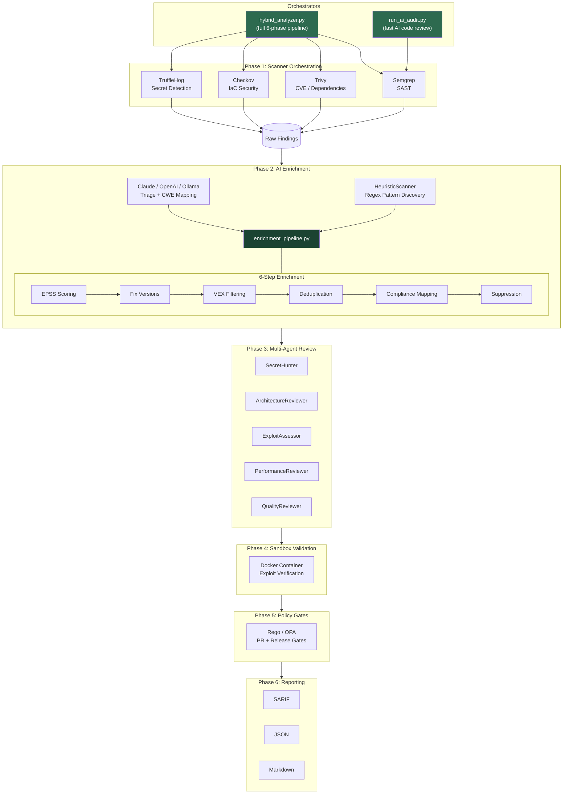

# Argus Security -- Pipeline Architecture

Argus Security runs a 6-phase security pipeline orchestrated by two entry points: `hybrid_analyzer.py` (full pipeline, Docker/standalone) and `run_ai_audit.py` (fast AI code review). Both share a common enrichment pipeline and configuration layer.

## 1. Pipeline Architecture

## 2. Module Dependencies

```mermaid
graph TD
    subgraph Orchestrators
        HA[hybrid_analyzer.py]
        RA[run_ai_audit.py]
    end

    subgraph "Shared Modules"
        CL[config_loader.py]
        EP[enrichment_pipeline.py]
        SV[schema_validator.py]
        PG[phase_gate.py]
        HS[heuristic_scanner.py]
        LR[license_risk_scorer.py]
    end

    subgraph "Enrichment Sub-modules"
        EPSS[epss_scorer.py]
        FV[fix_version_tracker.py]
        VEX[vex_processor.py]
        DD[vuln_deduplicator.py]
        CM[compliance_mapper.py]
        AS[advanced_suppression.py]
    end

    subgraph "Phase Modules (hybrid)"
        P1[hybrid/phases/phase1_scanning.py]
        P2[hybrid/phases/phase2_enrichment.py]
        P3[hybrid/phases/phase3_review.py]
        P4[hybrid/phases/phase4_sandbox.py]
        P5[hybrid/phases/phase5_policy.py]
        P6[hybrid/phases/phase6_reporting.py]
    end

    subgraph "Phase Support"
        AP[agent_personas.py]
        SB[sandbox_validator.py]
    end

    HA --> CL & EP & PG & HS & LR & SV
    HA --> P1 & P2 & P3 & P4 & P5 & P6
    RA --> CL & EP & PG & HS & LR & SV

    P3 --> AP
    P4 --> SB

    EP --> EPSS & FV & VEX & DD & CM & AS

    style HA fill:#2d6a4f,color:#fff
    style RA fill:#2d6a4f,color:#fff
    style EP fill:#1b4332,color:#fff
    style CL fill:#1b4332,color:#fff
```

